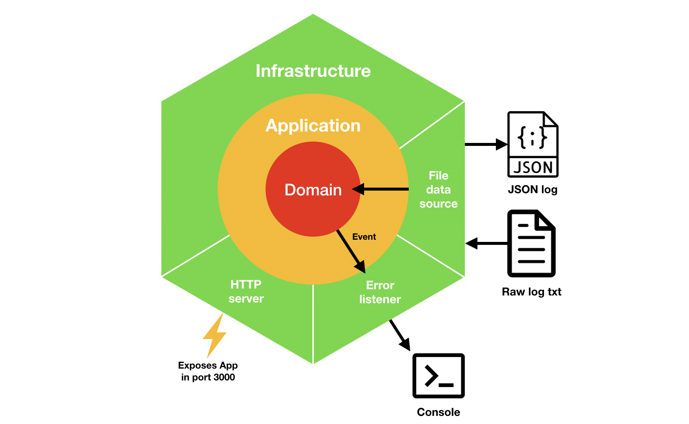

Server Access Analysis (exercise)
=================================

## Exercise description

### Main goal

- Parse a given [log file](src/infrastructure/persistence/fileDataSource/resources/epa-http.txt) and generate a new file in JSON format. Must look like the following example:

```
[
  {
    "host": "141.243.1.172",
    "datetime": {
      "day": "29",
      "hour": "23",
      "minute": "53",
      "second": "25"
    },
    "request": {
      "method": "GET",
      "url": "/Software.html",
      "protocol": "HTTP",
      "protocol_version": "1.0"
    },
    "response_code": "200",
    "document_size": "1497"
},
  ...more data sets...
]
```
 
- Provide an UI to render log results as graphic charts within following information:
    - Requests per minute over the entire time span
    - Distribution of HTTP methods (GET, POST, HEAD,...)
    - Distribution of HTTP response codes (200, 404, 302,...)
    - Distribution of the size of the response of all requests with code 200 and size < 1000B
    
### Log format

| Name          | Description                                                                                                                                                                                               |
|---------------|-----------------------------------------------------------------------------------------------------------------------------------------------------------------------------------------------------------|
| host          | Host making the request. A hostname when possible, otherwise the Internet address if the name could not be looked up                                                                                       |
| datetime      | Date in the format "[DD:HH:MM:SS]", where DD is either "29" or "30" for August 29or August 30, respectively, and HH:MM:SS is the time of day using a 24-hourclock. Times are EDT (four hours behind GMT). |
| request       | Request given in quotes                                                                                                                                                                                   |
| response_code | HTTP reply code.                                                                                                                                                                                          |
| document_size | bytes in the reply.                                                                                                                                                                                       |
    
### To keep in mind

- Ensure that all records are being imported
- Sanitize wrong characters

## Solution

### Architecture

I choosed an hexagonal architecture approach to keep dependency inversion principle. Content transformation must be
agnostic of low level details (file read, new file creation). Here you have a simple diagram of architecture:



### Domain

Domain entity contains the core of the functionality. It converts raw data in a valid JS object with the desired format. Tho diferent event are emitted when domain status change:

- CREATED: Is not used in this application. It has been provided for an potential use.
- ERRORED: Notifies a parser error. It has been provided to guarantee that all records are being imported.

Why events? Domain events remains domain to be decoupled from external layers.

### Application

You can find here all the frontend implementation. It's coupled to JSON structure created by domain.

### Infrastructure

Contains all low level components:

- HTTP: By using Express, exposes generated JSON file (consumed by application) and UI.
- File Data Source: By using read/write streams sends raw content to domain and stores results in a new JSON file. Why streams? Is a faster and 'memory cheap' method to read and create files.
- Error listener: By listening domain events, prints parse errors.

## Acknowledgements

The logs were collected by Laura Bottomley (laurab@ee.duke.edu) of Duke University.